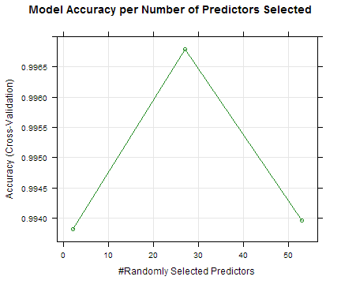

## Pumping Iron in the Forest: A Machine Learning "Exercise." :)
by Jude Calvillo 

Below, I will build, display, and cross-validate a "random forest" predictive model. This model aims to predict a physical exercise outcome, type of bicep curl (5 different types), from fitness tracker data (e.g. Fitbit) that initially includes 160 variables (yikes!).  

* [Source (thank you!) >>](http://groupware.les.inf.puc-rio.br/har)

### Pre-Processing / Cleaning
As you can see, the source dataset is rather large. More importantly, it includes a slew of variables that might predict the outcome of concern, the last variable: classe. Therefore, we should cut this down.


```r
## Load necessary libraries.
library(caret) # For training/ML.

## Get the data, size up, and preview.
the_data <- read.csv("data/pml-training.csv", na.strings = c("NA", ""))
# print(head(the_data)) # Not going to preview in markdown (too large).
print(dim(the_data))
```

```
## [1] 19622   160
```

##### Removing Useless Columns (variables)
It looks like, upon preview (too large to show here), the source data includes many columns that are made purely of NA values. Therefore, let's find them, remove them, and see how many useful variables our cleaned data frame ends up with.


```r
## Here, we get the sum of NAs per column (note, the margin argument of Apply
## function = 2, for columns only; default is 1, for rows/lists). Then, we replace
## the original df w/the a cleaner version of itself.
na_colsum <- apply(the_data, 2, function(x){sum(is.na(x))})
the_data <- the_data[, which(na_colsum == 0)]

## Size up and preview.
# print(head(the_data)) # Not going to preview in markdown (too large).
print(dim(the_data))
```

```
## [1] 19622    60
```

### Create the Training and 'Test' (Validation) Sets
Here, we simply partition the cleaned dataset, for the training set, and leave the remainder to the test/validation set.


```r
## Create the training set partition, as well as the remaining validation set.
train_sample <- createDataPartition(y = the_data$classe, p = 0.7, list = FALSE)
training_set <- the_data[train_sample, ]
validation_set <- the_data[-train_sample,]

## Size up and preview.
# print(head(training_set)) # Not going to preview here.
print(dim(training_set))
```

```
## [1] 13737    60
```

```r
print(dim(validation_set))
```

```
## [1] 5885   60
```


### Let's Learn!
Now, we train the model via random forest method. In doing so, we'll limit its number of folds, because, well, I ain't got all day!


```r
## Train using caret package (model = random forest or "rf"). Classe as outcome, predicted 
## by any/all other variables.
## DISCLAIMER: I found out that you can speed things up by limiting the number of folds the
##             method uses, so yeah, I'm doing that. I need my computer for other things!
the_forest1 <- train(classe ~ ., method = "rf", data = training_set, 
                     trControl = trainControl(method = "cv", number = 2))
```

##### What does this model look like?
Here, we'll output a breakdown of the model, which you can see maxes out its accuracy at 41 predictors. We'll plot the growth -and capping- of the model's accuracy below.

```r
## Let's 'see' a summary of the model.
print(the_forest1)
```

```
## Random Forest 
## 
## 13737 samples
##    59 predictor
##     5 classes: 'A', 'B', 'C', 'D', 'E' 
## 
## No pre-processing
## Resampling: Cross-Validated (2 fold) 
## Summary of sample sizes: 6869, 6868 
## Resampling results across tuning parameters:
## 
##   mtry  Accuracy   Kappa      Accuracy SD   Kappa SD    
##    2    0.9932300  0.9914363  0.0007199476  0.0009102389
##   41    0.9999272  0.9999079  0.0001029567  0.0001302217
##   81    0.9997816  0.9997238  0.0001029267  0.0001301838
## 
## Accuracy was used to select the optimal model using  the largest value.
## The final value used for the model was mtry = 41.
```

```r
## Point of 'best tune' (i.e. highest accuracy)?
print(paste("Best tune? (point of max accuracy):", the_forest1$bestTune, "randomly selected predictors"))
```

```
## [1] "Best tune? (point of max accuracy): 41 randomly selected predictors"
```

```r
## Plot the accuracy per predictors.
print(plot(the_forest1, col = "red", main = "Accuracy per Number of Random Predictors"))
```

 

And as you can see, the max accuracy is .9997, so the "in-sample error rate" is .0003 or .03%. Not bad, but with only 2 folds in our RF method, I expect the model to be a little biased. Let's see.  

### Cross-Validation / Out of Sample Error Rate
Now, let's test this model against our validation dataset, defined above. Ultimately, before we go testing this model on the REAL test data, we'd like to see what kind of an *out of sample error rate* we should expect.


```r
## Compute the predictions upon the validation set, using our forest model.
v_predictions <- predict(the_forest1, validation_set)

## Now, let's sum the # of correct predictions and divide by the total # of values to get 
## accuracy and, consequently, the error rate.
v_accuracy <- sum(v_predictions == validation_set$classe)/length(v_predictions)
oos_error <- 1 - v_accuracy

## Print error rate, prettily. :)
print(paste("Out of sample error rate: ",  round(oos_error*100,3), "% (percent)", sep = ""))
```

```
## [1] "Out of sample error rate: 0.017% (percent)"
```

##### *I therefore expect that the model will incur about the same out of sample error rate, when applied to the test data, as above.*

### Thank You

